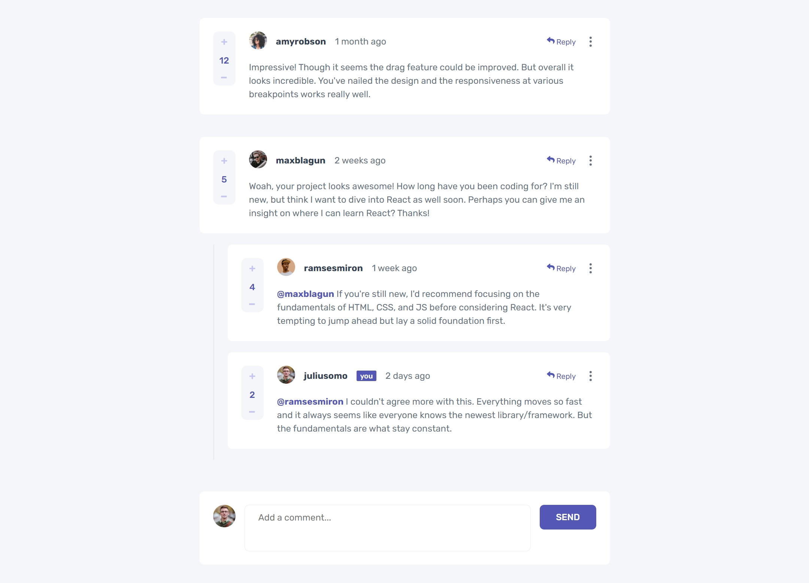
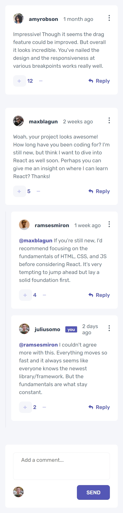
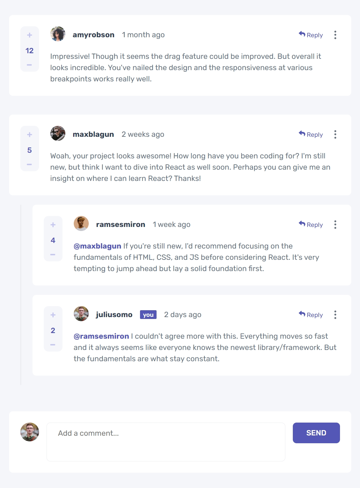

# Frontend Mentor - Interactive Comment Section Solution

This is a solution to the [Interactive comments section challenge on Frontend Mentor](https://www.frontendmentor.io/challenges/interactive-comments-section-iG1StatusY).

## Table of contents

- [Overview](#overview)
  - [The challenge](#the-challenge)
  - [Screenshot](#screenshot)
  - [Links](#links)
- [My process](#my-process)
  - [Built with](#built-with)
  - [Key Features](#key-features)
  - [Technical Highlights](#technical-highlights)
  - [Continued development](#continued-development)
  - [Useful resources](#useful-resources)
- [Author](#author)

## Overview

This project is a modern, interactive comment section built with **React**, **TypeScript**, and **Vanilla CSS**. It challenges the standard CRUD implementation by introducing an advanced universal "three dots" menu system and a highly responsive layout tailored for both desktop and mobile efficiency.

### The challenge

Users should be able to:

- View the optimal layout for the app depending on their device's screen size
- See hover states for all interactive elements on the page
- Create, Read, Update, and Delete comments and replies
- Upvote and downvote comments
- **Universal Header Menu**: Every comment and reply features a "three dots" kebab menu for Edit and Delete actions.
- **Mobile Optimized Layout**: On mobile, the kebab menu stays at the top right while the Reply action moves to the bottom right for better accessibility.

### Screenshot

### Links

- Solution URL: [GitHub Repository](https://github.com/MhistaFortune/Interactive-Comment-Section)
- Live Site URL: [Vercel Deployment](https://interactive-comment-section-pied.vercel.app/)

## My process

### Built with

- [React](https://reactjs.org/) - JS library
- [TypeScript](https://www.typescriptlang.org/) - For type-safe development
- [Vanilla CSS](https://developer.mozilla.org/en-US/docs/Web/CSS) - For custom styling and pixel-perfect control
- [Vite](https://vitejs.dev/) - Next Generation Frontend Tooling
- [LocalStorage API](https://developer.mozilla.org/en-US/docs/Web/API/Window/localStorage) - For data persistence

### Key Features

1.  **Universal "Three Dots" Menu**: Instead of standard buttons, I implemented a kebab menu system on *every* comment. This consolidates management actions (Edit/Delete) into a clean, professional dropdown.
2.  **State Persistence**: All comments, replies, and scores are saved in `localStorage`. Your interactions will persist even after a page refresh.
3.  **Nested Conversations**: Supports multi-level replies with clear visual threading and "Replying to" mentions.
4.  **Responsive Action Split**: A custom mobile layout where the menu stays in the header but the Reply button moves to the footer, optimizing for one-handed use on mobile devices.

### Technical Highlights

- **Custom Hooks**: Created a `useLocalStorage` hook to synchronize app state with the browser storage seamlessly.
- **Component Portals/Modals**: Implemented a focused Delete confirmation modal to prevent accidental data loss.
- **Clean Architecture**: Modularized components into `Comment`, `Reply`, and `Modal` directories for better maintainability.
- **Z-Index Management**: Solved complex overflow issues to ensure dropdown menus appear correctly over interactive cards.

### Continued development

- **Optimized Persistence**: Planning to integrate a backend like Supabase for real-time multi-user interactions.
- **Animations**: Adding Framer Motion for smoother transitions between editing and viewing modes.

### Useful resources

- [React Documentation](https://react.dev/) - A constant reference for best practices with hooks and state.
- [MDN - LocalStorage](https://developer.mozilla.org/en-US/docs/Web/API/Window/localStorage) - Essential for implementing the persistence layer.

## Author

- Frontend Mentor - [@MhistaFortune](https://www.frontendmentor.io/profile/MhistaFortune)
- Twitter - [@fortunate_egwu](https://x.com/fortunate_egwu)
